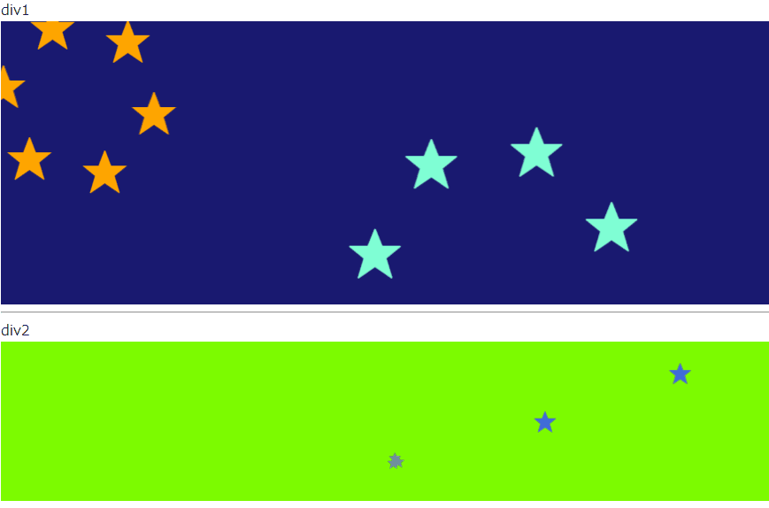

# これは何？
ウェブページにインタラクティブなアニメーションを追加するライブラリです。  
* らせん状に移動する星のアニメーションが自動で表示されます。
* クリックをするとその場所を中心に星のアニメーションが表示されます。
* ポインタの軌跡としてフェードアウトする円が表示されます。



# 使い方
ウェブページのもととなる HTML ファイルの body タグ内に以下の項目を設定します。  
1. 表示対象の div タグを作ります。 ID とサイズを設定してください。  
div のサイズに応じてアニメーションが描画されます。
```html
<div id="scSpiralStarView1" style="width:auto; height:320px;"></div>
<div id="scSpiralStarView2" style="width:auto; height:180px;"></div>
```
2. jQuery と pixiJS を読み込みます。  
```html
<script
	src="https://code.jquery.com/jquery-3.4.1.min.js"
	integrity="sha256-CSXorXvZcTkaix6Yvo6HppcZGetbYMGWSFlBw8HfCJo="
	crossorigin="anonymous"></script>
<script src="https://cdnjs.cloudflare.com/ajax/libs/pixi.js/5.0.3/pixi.min.js"></script>
```

3. ローカルに保存した scSpiralStar.js を読み込みます。以下の例では js フォルダに置かれています。  
https://github.com/sakura-crowd/scSpiralStar-JS-/blob/master/js/scSpiralStar.js から取得してご利用下さい。
```html
<script src="./js/scSpiralStar.js"></script>
```
4. scSpiralStar.setup 関数を、 div タグの ID やパラメータを指定して、呼び出します。  
例えば 2 つの div に個別に表示したい場合は、 ID などを変えて setup 関数を 2 回呼び出してください。  
```javascript
<script type="text/javascript">
	scSpiralStar.setup("scSpiralStarView1", {cntStarMin: 6, cntStarMax:12});
	scSpiralStar.setup("scSpiralStarView2", {cntStarMin: 2, cntStarMax: 3, backgroundColor:0x7cfc00, ballColorList:[0x00bfff, 0xda70d6]});
</script>
```
具体的には scSpiralStar.html を参考にしてください。  
  
試してみたいだけならば、まるごとプロジェクトをダウンロードして scSpiralStar.html をウェブブラウザで表示してください。

# パラメータ
scSpiralStar.setup 関数の第 2 引数で、以下のパラメータを上書きすることができます。  
指定しない場合は既定値で実行されます。  
* cntStarMin  
一度に発生する星の個数の下限値です。  
既定値は 3 です。
* cntStarMax  
一度に発生する星の個数の上限値です。  
既定値は 6 です。
* sizeStarMin  
星の大きさの下限値です。一度に発生する星はすべて同じ大きさです。  
既定値は 10 です。
* sizeStarMax  
星の大きさの上限値です。一度に発生する星はすべて同じ大きさです。  
既定値は 80 です。
* speedStarMin  
星の移動速度の下限値です。一度に発生する星はすべて同じ速度です。  
既定値は 5 です。
* speedStarMax  
星の移動速度の上限値です。一度に発生する星はすべて同じ速度です。  
既定値は 15 です。
* limitStarRotateMin  
星が消えるまでの回転角度(ラジアン)の下限値です。一度に発生する星はすべて同じ回転角度です。  
既定値は 2.0 * Math.PI * 1 です。
* limitStarRotateMax  
星が消えるまでの回転角度(ラジアン)の上限値です。一度に発生する星はすべて同じ回転角度です。  
既定値は 2.0 * Math.PI * 9 です。
* starColorList  
星の色の候補です。一度に発生する星はすべて同じ色です。  
既定値は [0xff1493, 0xffa500, 0x7fffd4, 0x556b2f, 0x4169e1, 0x778899, 0xdaa520] です。

* cntBall  
ポインタの軌跡として表示される円の個数です。多いほうが長い軌跡が表示されます  
既定値は 128 です。
* sizeBall  
ポインタの軌跡として表示される円の大きさです。  
既定値は 50 です。
* ballAlphaBegin  
ポインタの軌跡として表示される円のアルファ値です。1は透過せず0は透明です。  
既定値は 1 です。
* ballAlphaAdder  
ポインタの軌跡として表示される円のアルファ値の変化量(フレーム単位)です。負の値を指定してください。  
既定値は -0.08 です。
* ballColorList  
ポインタの軌跡として表示される円の色の候補です。  
複数の色を指定した場合、円ごとにランダムに候補の色が割り当てられます。  
既定値は [0xffff88] です。

* intervalRandomSpawnMin  
星のアニメーションが自動で発生するまでの待ち時間(フレーム単位)の下限値です。  
既定値は 100 です。
* intervalRandomSpawnMax  
星のアニメーションが自動で発生するまでの待ち時間(フレーム単位)の上限値です。  
既定値は 150 です。

* backgroundColor  
描画範囲の背景色です。  
既定値は 0x191970 です。

# 制限事項
* グローバル空間に scSpiralStar を定義します。
* PixiJS が動作する環境が必要です。
* jQuery が動作する環境が必要です。

# 動作確認環境
* windows 10 Home 64bit
	* Google Chrome

# ライセンスについて
license.txt を参照してください。

# 更新履歴
* 2019/06/20 新規作成・公開

